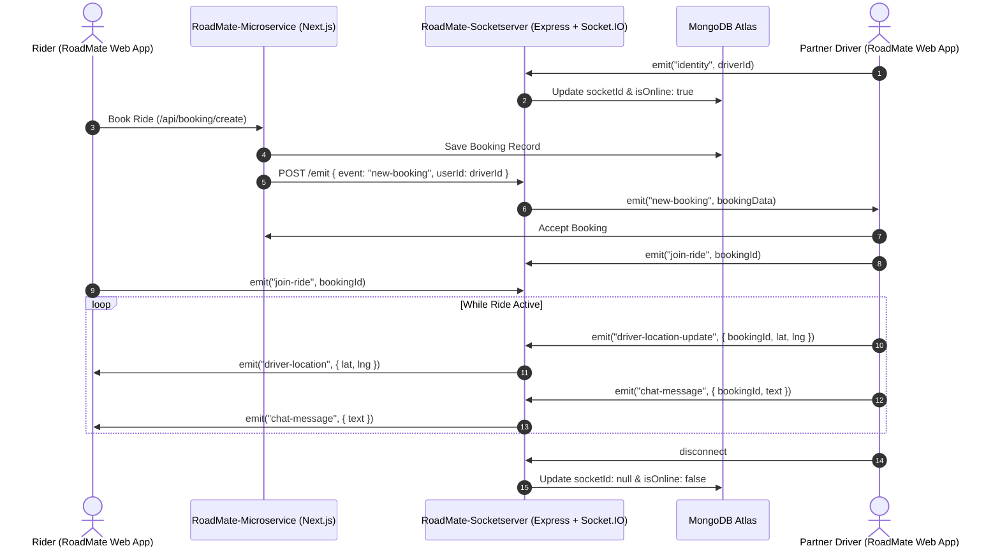

# RoadMate Socket Microservice
### Real-Time Event & Geospatial Dispatch Server

[](https://nodejs.org/)
[](https://expressjs.com/)
[](https://socket.io/)
[](https://www.mongodb.com/)
[](https://github.com/bibek-totol/RoadMate-Microservice)

The **RoadMate Socket Microservice** is a dedicated real-time event hub and geospatial synchronization engine built with **Express 5** and **Socket.IO 4.8**. It coordinates real-time communication between the Next.js frontend, mobile web riders, partner drivers, and the MongoDB database.

---

## Ecosystem Architecture & Repositories

This microservice acts as the real-time communication backbone for the **RoadMate** platform, working in close tandem with the main web application:

| Repository | Role | Purpose & Tech |
|---|---|---|
| **[RoadMate-Socketserver](https://github.com/bibek-totol/RoadMate-Socketserver)** *(This Repo)* | **Real-Time Event & Dispatch Microservice** | Node.js, Express 5, and Socket.IO 4.8 engine handling live GPS coordinates, ride dispatches, private ride rooms, in-ride chat, and user presence tracking. |
| **[RoadMate-Microservice](https://github.com/bibek-totol/RoadMate-Microservice)** | **Core Web App & API Gateway** | Next.js 16 App Router, React 19, Redux Toolkit, Tailwind CSS v4, NextAuth v5, Stripe checkout, ZegoCloud Video KYC, and MongoDB persistence. |

### How the Two Services Work Together
1. **Real-Time WebSockets**: Riders and drivers browsing the [RoadMate-Microservice](https://github.com/bibek-totol/RoadMate-Microservice) web client establish a persistent WebSocket connection to this server.
2. **Server-to-Server Webhook Push (`/emit`)**: When a booking is created or updated in the Next.js app, its backend makes an internal HTTP `POST /emit` call to this microservice, which pushes the event directly to the targeted driver or rider.
3. **Shared MongoDB Atlas Cluster**: Both services share the same MongoDB database, allowing this microservice to update user online presence (`isOnline`), active socket references (`socketId`), and driver GeoJSON coordinates (`location`) in real time.

---

## Key Responsibilities

- **Live Location & Geospatial Tracking**: Receives continuous GPS coordinate updates from online drivers and updates their GeoJSON `Point` coordinates in MongoDB for geospatial queries.
- **Real-Time Ride Broadcasts**: Relays instant ride requests, driver acceptances, and booking cancellations directly to targeted users without page reloads.
- **Active Ride Rooms**: Creates dedicated socket rooms (`ride-{bookingId}`) for live telemetry streaming between the driver and rider during an active trip.
- **In-Ride Real-Time Chat**: Relays instant chat messages between rider and driver within their private ride room.
- **Presence Management**: Maintains connection state (`isOnline: true/false`) and maps socket IDs to MongoDB User records with automated cleanup on disconnection.
- **Server-to-Server Webhook Gateway (`/emit`)**: Allows Next.js API routes to trigger targeted real-time push events to specific users via an internal HTTP POST endpoint.
- **Self-Healing Keep-Alive**: Periodically pings its health endpoint every 10 minutes to prevent cold starts on free-tier cloud platforms (e.g., Render) while broadcasting heartbeats to connected clients.

---

## Architecture & Interaction Flow



---

## Socket Events Reference

### Client ➔ Server Events

| Event Name | Payload | Description |
|---|---|---|
| `identity` | `userId: string` | Links the socket session to the MongoDB user and marks the user as online. |
| `update-location` | `{ userId, latitude, longitude }` | Updates the driver's current GeoJSON coordinates in MongoDB for radius searches. |
| `join-ride` | `bookingId: string` | Joins the socket to a private room: `ride-${bookingId}`. |
| `driver-location-update` | `{ bookingId, latitude, longitude, status }` | Broadcasts live vehicle coordinates to all participants in `ride-${bookingId}`. |
| `chat-message` | `{ bookingId, senderId, message, timestamp }` | Broadcasts in-ride messages to all participants in `ride-${bookingId}`. |
| `disconnect` | *(internal)* | Automatically clears the user's `socketId` and sets `isOnline: false` in MongoDB. |

### Server ➔ Client Events

| Event Name | Payload | Description |
|---|---|---|
| `driver-location` | `{ latitude, longitude }` | Live GPS coordinates streamed to the rider's map view. |
| `chat-message` | Message payload | Delivered to riders/drivers in the same active ride room. |
| `heartbeat` | `{ message, timestamp }` | Periodic health confirmation emitted every 10 minutes. |
| `new-booking` | Booking details | Dispatched to the partner driver when a nearby rider requests a ride. |
| `cancel-booking` | Booking details | Notifies the partner driver if a booking is cancelled. |

---

## HTTP REST Endpoints

### 1. Root Check
- **Endpoint**: `GET /`
- **Response**: `"Hello I am Roadmate SocketServer"`

### 2. Health Endpoint
- **Endpoint**: `GET /health`
- **Response**:
  ```json
  {
    "status": "ok",
    "message": "Hello I am Roadmate SocketServer",
    "timestamp": "2026-09-08T12:00:00.000Z"
  }
  ```

### 3. Server-Side Push Gateway
- **Endpoint**: `POST /emit`
- **Description**: Triggered by the [RoadMate-Microservice](https://github.com/bibek-totol/RoadMate-Microservice) Next.js server to emit a socket event to a specific user.
- **Request Body**:
  ```json
  {
    "userId": "64f1a2b3c4d5e6f7a8b9c0d1",
    "event": "new-booking",
    "data": {
      "bookingId": "64f1a2b3c4d5e6f7a8b9c0d2",
      "fare": 350
    }
  }
  ```
- **Response**:
  ```json
  {
    "success": true
  }
  ```

---

## Environment Variables

Create a `.env` file in the `socketServer` directory:

```env
# Server Port (default: 8000)
PORT=8000

# MongoDB Connection String (must match RoadMate-Microservice's database)
MONGODB_URL="mongodb+srv://<username>:<password>@cluster.mongodb.net/roadmate?retryWrites=true&w=majority"

# Frontend Next.js Application URL (for CORS allowance)
NEXT_BASE_URL="http://localhost:3000"

# Optional Cloud Deployment URLs (for keep-alive self-pings on Render / Railway)
RENDER_EXTERNAL_URL="https://roadmate-socketserver.onrender.com"
```

---

## Getting Started

### Prerequisites
- **Node.js**: v18.0.0 or higher
- **MongoDB**: Access to the shared RoadMate MongoDB Atlas instance
- **Companion App**: [RoadMate-Microservice](https://github.com/bibek-totol/RoadMate-Microservice) running on Port 3000

### Installation & Run

1. **Navigate to the directory**:
   ```bash
   cd socketServer
   ```

2. **Install dependencies**:
   ```bash
   npm install
   ```

3. **Configure Environment**:
   Copy `.env.example` to `.env` and fill in your credentials:
   ```bash
   cp .env.example .env
   ```

4. **Start the Server**:
   - **Development mode** (with nodemon auto-restart):
     ```bash
     npm run dev
     ```
   - **Production mode**:
     ```bash
     npm start
     ```

The server will initialize on `http://localhost:8000` (or your configured `PORT`) and connect to MongoDB.

---

## Deployment Notes

### Deploying on Render / Railway:
1. Set the **Build Command** to `npm install`.
2. Set the **Start Command** to `node index.js`.
3. Add environment variables:
   - `PORT`: `8000` (or let Render set it dynamically)
   - `MONGODB_URL`: Your MongoDB connection URI
   - `NEXT_BASE_URL`: Your deployed frontend URL (e.g. `https://road-mate-microservice.vercel.app`)
   - `RENDER_EXTERNAL_URL`: Your Render service URL (enables the automated 10-minute self-ping to prevent instance sleeping)

---

## License

This microservice is licensed under the ISC License.
